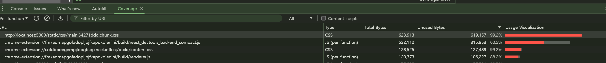

# 불필요 CSS 제거

tailwind의 불필요한 CSS를 제거하여 CSS 파일 크기를 줄일 수 있다.
개발자 도구의 Coverage 패널에서는 페이지에서 사용하는 JS 및 CSS 리소스에서 실제 실행하는 코드가 얼마나 되는지 알려준다.

## PurgeCSS

PurgeCSS는 파일에 들어 있는 모든 키워드를 추출하여 해당 키워드를 이름으로 갖는 CSS 클래스만 보존하고 나머지 매칭되지 않는 클래스는 모두 지우는 방식으로 CSS 파일을 최적화한다.
