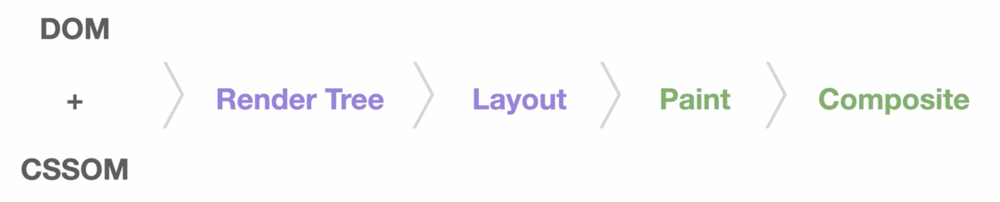
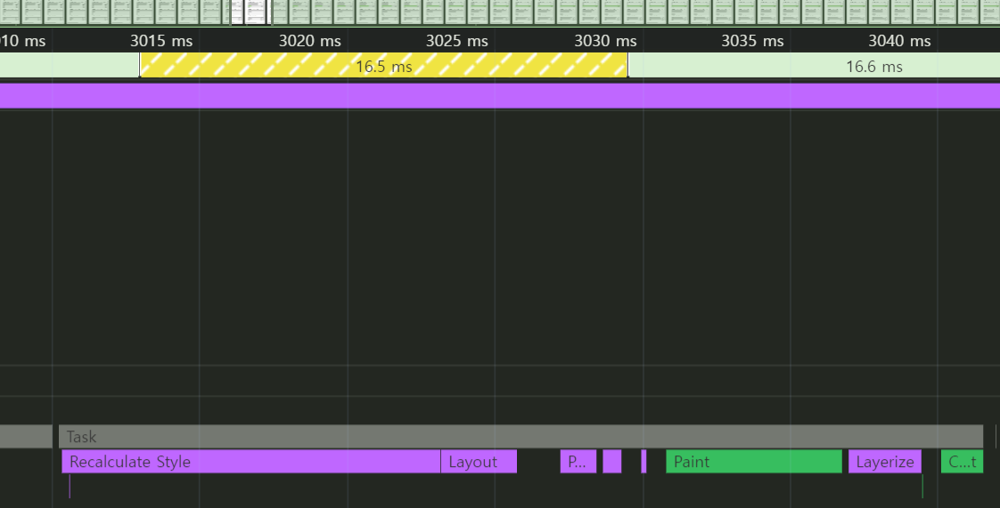
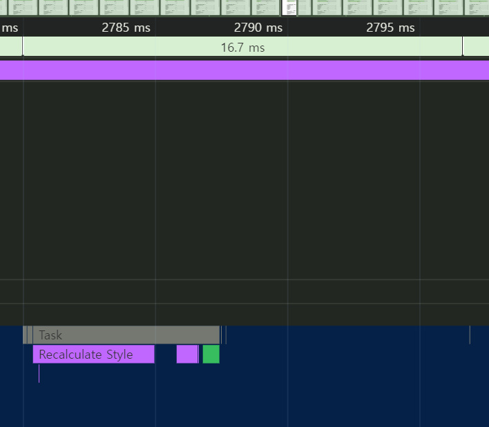

# 애니메이션 최적화

쟁크: 애니메이션의 초당 프레임 수가 60이 안되어 부드럽지 않고 끊기는 것처럼 보이는 현상

일반적으로 사용하는 디스플레이의 주사율은 60Hz이고, 브라우저도 이에 맞춰 최대 60FPS로 1초에 60장의 화면을 새로 그린다.

## 브라우저 렌더링 과정



브라우저는 위와 같은 과정을 거쳐서 화면을 그리고, 이를 Critical Rendering Path라고 한다.

### DOM + CSSOM

HTML, CSS 등 화면에 필요한 리소스를 다운로드한다.
다운로드한 HTML은 브라우저가 이해할 수 있는 형태로 변환하는 파싱 과정을 거쳐 DOM을 만든다.
마찬가지로 CSS도 브라우저가 이해할 수 있는 형태로 변환하여 CSSOM을 생성한다.
CSSOM은 각 요소가 어떤 스타일을 포함하고 있는지에 대한 정보를 포함한다.

### 렌더 트리

DOM과 CSSOM의 결합으로 생성된다,

### 레이아웃

렌더 트리가 완성이 되면 레이아웃 단계로 넘어간다.
이 단계에서는 화면 구성 요소의 위치나 크기를 계산하고, 배치하는 작업을 한다.

### 페인트

페인트 단계에서는 화면에 배치된 요소에 색을 채워 넣는 작업을 한다.
**이때 브라우저는 효율적인 페인트 과정을 위해 구성 요소를 여러 개의 레이어로 나눠서 작업하기도 한다.**

### 컴포지트

컴포지트 단계는 각 레이어를 합성하는 작업을 한다.
페인트 단계에서 여러 개의 레이어로 화면을 쪼개 그렸다면, 마지막에 레이어를 하나로 합성한다.

## 리플로우와 리페인트

화면이 모두 그려진 후, JS로 인해 화면 내 어떤 요소의 너비와 높이가 변경되었다면, 해당 요소의 가로와 세로를 다시 계산해 화면을 새로 그릴 것이다.

리플로우는 Critical Rendering Path의 모든 단계를 실행하고,
리페인트는 Critical Rendering Path의 레이아웃 단계를 제외한 모든 단계를 실행한다.



width가 변하는 animation의 경우 리플로우 과정이 16.7ms 이내로 이루어지지 않아 쟁크 현상이 발생하고 있다.

## 하드웨어 가속(GPU 가속)

하드웨어 가속은 CPU에서 처리해야 할 작업을 GPU에 위임하여 효율적으로 처리하는 방법이다. GPU는 애초에 그래픽 작업을 처리하기 위해 만들어진 것이므로 화면을 그릴 때 활용하면 굉장히 빠르다.

특정 요소에 하드웨어 가속을 사용하려면 요소를 별도의 레이어로 분리하여 GPU로 보내야 하는데, transform 속성과 opacity 속성이 이 역할을 한다.

분리된 레이어는 GPU에 의해 처리되어 레이아웃 단계와 페인트 단계 없이 화면상의 요소의 스타일을 변경할 수 있다.

<br>

_transform: translate() 는 처음부터 페이지를 분리하지 않고 변화가 일어나는 순간 레이어를 분리한다. 반면 transform: translate3d() 와 같은 3d 속성들, 또는 will-change 속성은 처음부터 레이어를 분리해 두기 때문에 변화에 더욱 빠르게 대처할 수 있다. 물론 레이어가 너무 많아지면 그만큼 메모리를 많이 사용하기 때문에 주의해야 한다._

## 최적화

```css
.bar-graph {
  transform: scaleX($ {({width}) => width / 100});
  transform-origin: center left;
  transition: transform 1.5s ease;
}
```


