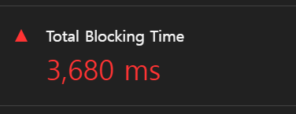
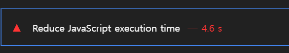
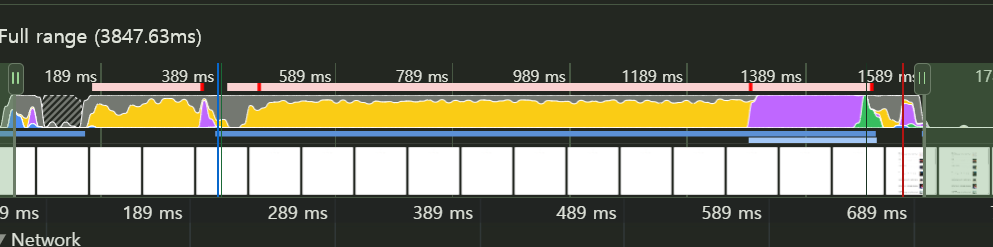
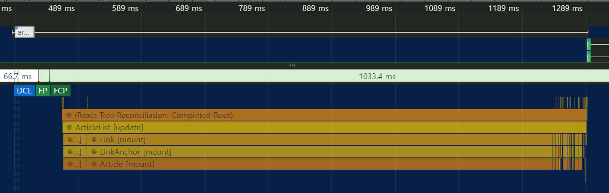

# 병목 코드 최적화

## 병목 코드 분석하기

메인 스레드에서 50ms 이상 소요되는 긴 작업이 많아 TBT가 길다면 병목 현상이 일어나고 있는 것이다.

Lighthouse의 View Trace나 개발자 도구의 Performance 탭을 활용해 좀 더 분석할 수 있다.

1. CPU 차트의 빨간색 선은 병목이 발생하는 지점을 나타낸다.
   
2. Timing 섹션에서 리액트 컴포넌트의 렌더링 시간을 측정할 수 있다.
   
