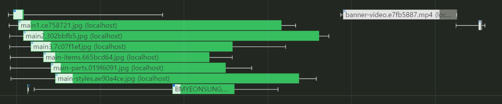

# 이미지 지연 로딩



메인 페이지의 모든 리소스가 다운로드 되면서, 동영상 리소스의 다운로드가 후순위로 밀려났다.

동영상이 페이지 가장 상단에 있기 때문에 이미지 리소스의 다운로드를 후순위로 미루고 싶다.

뷰포트에 이미지가 들어올 때 리소스를 로드해보도록 하자

## Intersection Observer

```jsx
import React, { useRef, useEffect } from "react";

function Card(props) {
  const imgRef = useRef(null);

  useEffect(() => {
    const options = {};
    const callback = (entries, observer) => {
      entries.forEach((entry) => {
        if (entry.isIntersecting) {
          entry.target.src = entry.target.dataset.src;
          observer.unobserve(entry.target);
        }
      });
    };

    const observer = new IntersectionObserver(callback, options);

    observer.observe(imgRef.current);

    return () => observer.disconnect();
  }, []);

  return (
    <div className="Card text-center">
      
      <div className="p-5 font-semibold text-gray-700 text-xl md:text-lg lg:text-xl keep-all">
        {props.children}
      </div>
    </div>
  );
}

export default Card;
```

이미지의 주소를 data-src에 넣고, 뷰포트에 들어왔을 때 그 값을 src로 옮겨 이미지를 로드한다.
이렇게 하면 src 값이 할당되지 않기 때문에 처음에 이미지를 로드하지 않는다.
