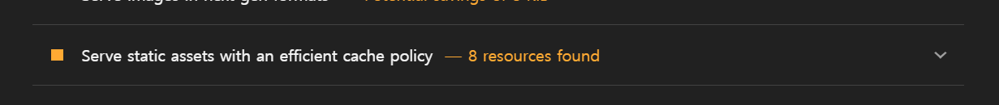

# 캐시 최적화

네트워크를 통해 다운로드하는 리소스에 캐시를 적용하라는 의미
응답 헤더 설정으로 캐시 설정을 할 수 있다.

## 캐시란?

사용자가 자주 보는 데이터를 어딘가에 저장해 두었다가 백엔드에 요청할 필요 없이 바로 보여주고 싶을 때 캐시를 사용한다.

캐시: 데이터를 미리 복사해 놓는 임시 장소
캐싱: 캐시를 사용하는 행위

### 캐시의 종류

웹에서 사용하는 캐시는 크게 두 가지로 구분할 수 있다.

- 메모리 캐시: 메모리(RAM)에 저장하는 방식
- 디스크 캐시: 파일 형태로 디스크에 저장하는 방식

어떤 캐시를 사용할지는 직접 제어할 수 없다.

## Cache-Control

캐시가 적용된 리소스의 응답 헤더를 보면 Cache-Control이라는 헤더가 들어 있는 것을 볼 수 있다.
이 헤더는 서버에서 설정되며, 이를 통해 브라우저는 해당 리소스를 얼마나 캐시할지 판단한다.

아래 5가지 값이 조합되어 들어간다.

- no-cache: 캐시를 사용하기 전 서버에 검사 후 사용
- no-store: 캐시 사용 안 함
- public: 모든 환경에서 캐시 사용 가능
- private: 브라우저 환경에서만 캐시 사용, 외부 캐시 서버에서는 사용 불가
- max-age: 캐시의 유효 시간

no-cache는 캐시를 사용하지 않는 것이 아닌 사용 전에 서버에 캐시된 리소스를 사용해도 되는지 한 번 체크하도록 하는 옵션이다.

캐시를 사용하지 않는 옵션은 no-store다.

public과 private로 설정하면 max-age에서 설정한 시간 만큼은 서버에 사용 가능 여부를 묻지 않고 캐시된 리소스를 바로 사용한다.
만약 유효 시간이 지났다면 서버에 캐시된 리소스를 사용해도 되는지 다시 체크하고 유효 시간만큼 더 사용한다.
public과 private의 차이는 캐시 환경에 있다. 웹 리소스는 브라우저뿐만 아니라 웹 서버와 중간 캐시 서버에서도 캐시될 수 있다.
만약 중간 서버에 캐시를 적용하고 싶지 않다면 private 옵션을 사용한다.

max-age는 초 단위로 얼마나 캐시를 사용할 것인지 설정한다.

 

📖 캐시된 리소스와 서버의 최신 리소스가 같은지 어떻게 체크할까?

캐시 유효 시간이 만료되면 브라우저는 캐시된 리소스를 계속 사용해도 될지 서버에 확인한다.
이때 서버에서는 캐시된 리소스의 응답 헤더의 Etag 값과 서버의 최신 리소스의 Etag 값을 비교하여 캐시된 리소스가 최신인지 아닌지(즉, 계속 사용해도 되는지)를 판단한다.

## 적절한 캐시 유효 시간

일반적으로 HTML 파일에는 no-cache 설정을 적용한다.
항상 최신 버전의 리소스를 제공하면서도 변경 사항이 없을 때만 캐시를 사용하는 no-cache 설정을 적용한다.

하지만 JS나 CSS, 이미지의 경우 캐시를 아무리 오래 적용해도 HTML만 최신 상태라면 당연히 최신 리소스를 제공할 것이다. 따라서 반영구적인 기간을 적용한다.
