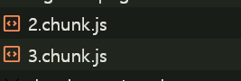

# 컴포넌트 지연 로딩

## 모달 코드 분리하기

```jsx
const ImageModal = lazy(() => import("./components/ImageModal"));

// ...

{
  showModal && (
    <Suspense fallback={null}>
      <ImageModal
        closeModal={() => {
          setShowModal(false);
        }}
      />
    </Suspense>
  );
}
```

이렇게 하면 정적으로 import되어서 번들 파일에 포함되었던 ImageModal 컴포넌트와 그 안에서 사용되고 있는 react-image-gallery 라이브러리가 청크 파일에서 분리된다.

버튼을 클릭해 모달이 뜨면 새로운 청크 파일이 로드되는 것을 확인할 수 있다.



# 컴포넌트 사전 로딩

## 지연 로딩의 단점

컴포넌트 지연 로딩 기법을 사용했을 때 당장 필요 없는 모달과 관련된 코드가 번들에 포함되지 않아 초기 로딩 속도 측면에서 이점이 있었다.

하지만 모달을 띄우는 시점에는 네트워크를 통해 모달 청크 코드를 새로 로드해야 하고, 로드가 완료된 시점에 모달을 띄울 수 있는 단점이 있다.

## 사전 로딩

필요한 모듈을 미리 로드하는 기법

**고려해볼만한 사전 로딩 타이밍**

1. 버튼 위에 마우스를 올려놨을 때 (mouseenter)
2. 최초 페이지가 로드된 후에

### 버튼 위에 마우스를 올려놨을 때

```jsx
const handleMouseEnter = () => {
  const _component = import("./components/ImageModal");
};

<ButtonModal
  onClick={() => {
    setShowModal(true);
  }}
  onMouseEnter={handleMouseEnter}
>
  올림픽 사진 보기
</ButtonModal>;
```

Network 탭에서 확인해보면 버튼에 커서를 올려놓기만 해도 모달 청크 파일이 로드되는 것을 확인할 수 있다.

결과적으로 버튼을 클릭하기 전에 모달 코드를 준비해 두어 딜레이 없이 모달을 띄울 수 있게 된다.

### 최초 페이지가 로드된 후에

```jsx
useEffect(() => {
  const _component = import("./components/ImageModal");
}, []);
```
