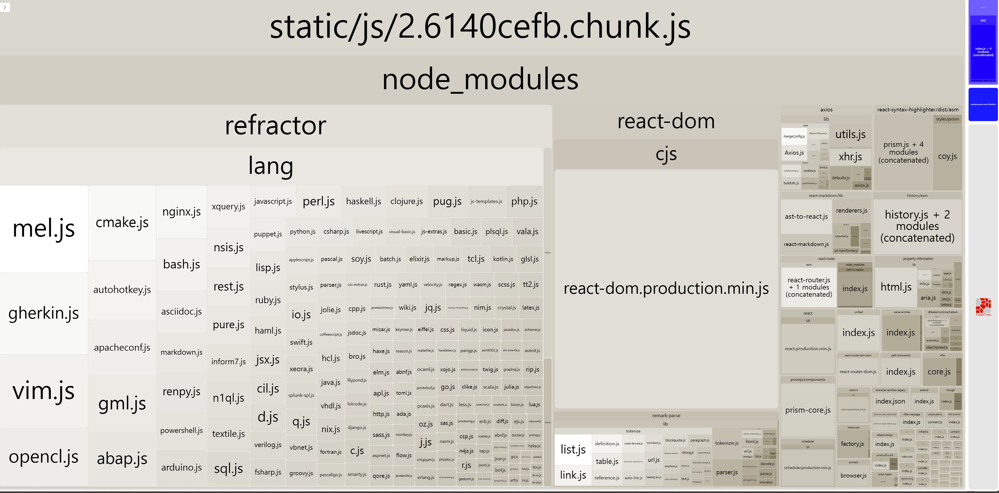

# 코드 분할 & 지연 로딩

## 번들 파일 분석

번들된 파일을 분석하기 위해 Webpack Bundle Analyzer라는 패키지를 사용할 수 있다.

```
npm i -D cra-bundle-analyzer
npx cra-bundle-analyzer
```



이름으로 유추했을 때 외부 모듈은 2.chunk.js, 서비스 코드는 우측 상단의 파란색 블록으로 번들링 되는 것을 확인할 수 있다.

하나의 파일로 번들링되어 모듈을 사용하지 않는 페이지를 로딩할 때에도 초기 로딩 속도가 느려지는 문제점이 있다.

## 코드 분할이란

코드 분할이란 하나의 번들 파일을 여러 개의 파일로 쪼개는 방법이다.
분할된 코드는 해당 코드가 필요해지는 시점에 로드되어 실행되고, 이를 지연 로딩이라고 한다.

## 코드 분할 적용하기

```jsx
import { Suspens } from "react";

const SomeComponent = React.lazy(() => import("./SomeComponent"));

function MyComponent() {
  return (
    <Suspense fallback={<h1>Loading...</h1>}>
      <SomeComponent />
    </Suspense>
  );
}
```
